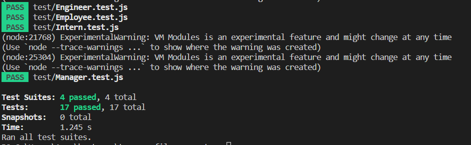

# team-profile-generator

## TABLE OF CONTENTS
- [Description](#description)
- [Installation](#installation)
- [Usage](#usage)
- [License](#license)
- [Contributors](#contributors)
- [Tests](#tests)
- [Contact](#contact)

## Description
generates a team.html file using inquirer plugin
sample HTML can be found in the /sample folder

## INSTALLATION
install inquirer and execute through node.js

## USAGE
  * 'npm start' in the terminal and answer the prompts
  * select 'finish' to export team.html
  * see video below of sample demo

## LICENSE
  MIT

## CONTRIBUTORS
  N/A

## TESTS
  simple test suite containing 4 modules using Jest
  Execute Tests with the following code:
   * `node --experimental-vm-modules node_modules/jest/bin/jest.js`

  Tests can be found in /test folder
  tests check the classes for each employee and their properties are accurate
  

## CONTACT
  N/A
  